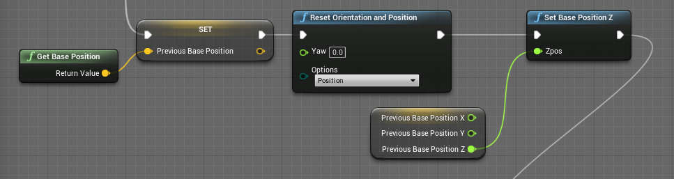

# InnerLoop Functions

A simple plugin for Unreal Engine 4 which adds a few basic blueprint functions.

## Installation
1) Place the *'InnerLoopLLC'* folder in *'Engine/Plugins/Marketplace'* 
2) Regenerate project files 
3) Compile engine 

## Functions
* **WithEditor** - Returns Bool if project is running in UE4 editor or not. 
* **IsWithEditor** - Same as WithEditor, but with branched outputs. *(useful for skipping cinematics/etc while developing)* 
* **GetProjectVersion** - Returns Project Version as set in Project Description. *(useful for displaying project version in game)* 
* **SetProjectVersion** - Sets the Project Version. *(WARNING: not useful in its current form)* 
* **GetTextFromFile** - Reads a .txt file and returns contents as a string. *(useful for including update notes in game)* 
* **PrintToLog** - Prints string to log file in packaged builds. *(logs must be enabled for this to work in shipping builds)* 
* **HMD|GetBasePosition** - Returns center of playspace. 
* **HMD|SetBasePositionZ** - Sets new center of playspace. *(useful for re-centering playspace without adjusting floor Z)* 
* **System Info|GetGPUAdapterName** - Returns name of installed GPU. *(useful for automatically configuring settings)* 
* **System Info|RHIVendorName** - Returns vendor of installed GPU. 

### Example: Re-centering playspace without adjusting floor height
This uses the XR system to re-center the user's playspace without changing floor height. This is useful for maintaining the floor height as configured by the user. Currently only works for SteamVR, but may eventually work for other platforms. 

